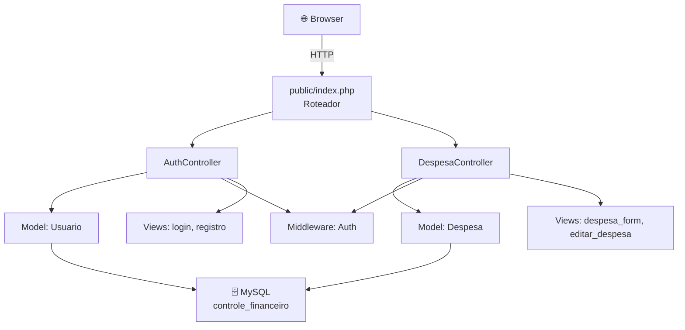
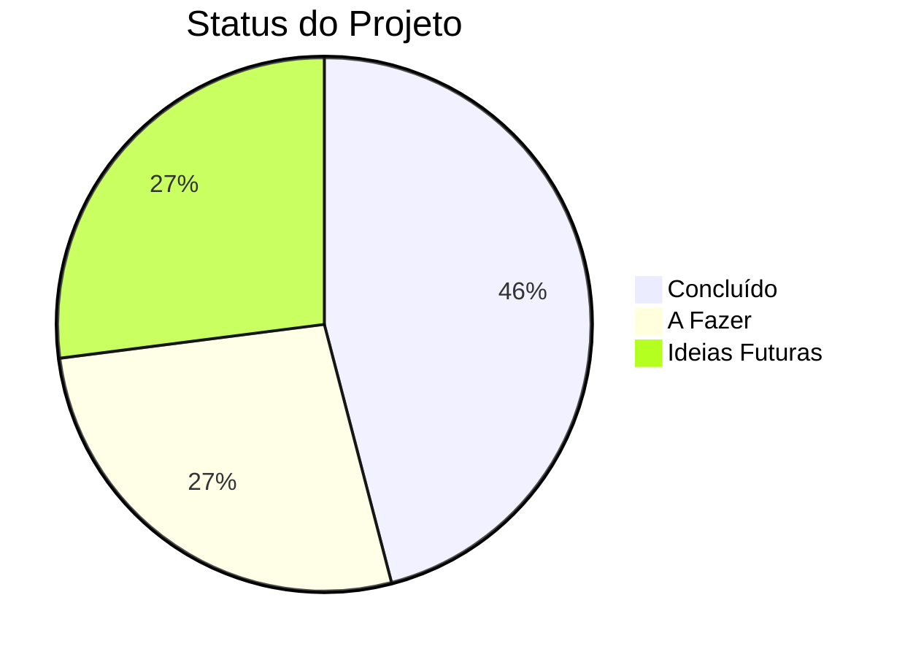

# 📋 Trello — Controle Financeiro Web

> **Projeto:** ControleFinanceiroWeb
> **Stack:** PHP 8.5 · MySQL 8.0 · HTML/CSS/JS
> **Última atualização:** 29/04/2026

---

## 🏗️ Arquitetura do Projeto



---

## 📁 Estrutura de Arquivos

```
Projeto/
├── public/                    # Pasta raiz do servidor web
│   ├── index.php              # Entry point + roteador
│   ├── editar.php             # Rota de edição
│   └── assets/
│       └── style.css          # Estilos globais
├── app/
│   ├── Config/
│   │   └── Database.php       # Conexão PDO + migrations automáticas
│   ├── Controllers/
│   │   ├── AuthController.php # Login, registro, logout
│   │   └── DespesaController.php # CRUD de despesas
│   ├── Middleware/
│   │   └── Auth.php           # Proteção de rotas
│   ├── Models/
│   │   ├── Usuario.php        # Model de usuários
│   │   └── Despesa.php        # Model de despesas
│   └── Views/
│       ├── login.php          # Tela de login
│       ├── registro.php       # Tela de cadastro
│       ├── despesa_form.php   # Dashboard principal
│       └── editar_despesa.php # Tela de edição
├── database/
│   └── schema.sql             # Schema do banco
└── data/                      # (legado, não mais utilizado)
```

---

## ✅ Concluído

| # | Tarefa | Detalhes |
|---|--------|----------|
| 1 | **Estrutura MVC** | Controllers, Models, Views e Middleware organizados |
| 2 | **Banco de dados MySQL** | Conexão PDO com migrations automáticas |
| 3 | **Tela de Login** | Formulário com validação e CSRF token |
| 4 | **Tela de Registro** | Cadastro com validação de email, senha mínima, confirmação |
| 5 | **Autenticação com bcrypt** | Senhas hasheadas com `password_hash` / `password_verify` |
| 6 | **Sessões seguras** | `session_regenerate_id` no login, proteção CSRF em todos os forms |
| 7 | **Middleware de autenticação** | Proteção de rotas — redireciona pra login se não logado |
| 8 | **Dashboard** | Tela principal com formulário de adicionar despesa |
| 9 | **Adicionar despesa** | Nome, valor, data — com validação completa |
| 10 | **Listar despesas** | Modal com lista de despesas e total calculado |
| 11 | **Editar despesa** | Tela dedicada para edição de despesa existente |
| 12 | **Remover despesa (soft delete)** | Marca como excluída sem apagar do banco |
| 13 | **Lixeira / Histórico** | Modal mostrando despesas excluídas com badge "Excluída" |
| 14 | **Isolamento por usuário** | Cada usuário só vê suas próprias despesas |
| 15 | **Logout seguro** | Destrói sessão e cookie |
| 16 | **CSS responsivo** | Layout adaptável para mobile e desktop |
| 17 | **Header com avatar** | Mostra inicial do nome + botão sair |

---

## 🔨 A Fazer — Melhorias

| # | Tarefa | Prioridade | Descrição |
|---|--------|------------|-----------|
| 1 | **Filtro por mês/ano** | 🔴 Alta | Filtrar despesas por período na listagem |
| 2 | **Categorias de despesa** | 🔴 Alta | Alimentação, Transporte, Moradia, Lazer, etc. |
| 3 | **Gráfico de gastos** | 🟡 Média | Chart.js com pizza ou barras por categoria/mês |
| 4 | **Página de perfil** | 🟡 Média | Editar nome, email, trocar senha |
| 5 | **Recuperação de senha** | 🟡 Média | "Esqueci minha senha" por email |
| 6 | **Receitas (entradas)** | 🟡 Média | Registrar salário/renda para calcular saldo |
| 7 | **Orçamento mensal** | 🟡 Média | Definir limite mensal e alertar quando perto |
| 8 | **Exportar dados** | 🟢 Baixa | Exportar despesas em CSV ou PDF |
| 9 | **Busca de despesas** | 🟢 Baixa | Buscar por nome da despesa |
| 10 | **Paginação** | 🟢 Baixa | Paginar lista quando tiver muitas despesas |

---

## 💡 Ideias Futuras

| # | Ideia | Descrição |
|---|-------|-----------|
| 1 | **Dashboard com cards resumo** | Cards: Total mês, Total ano, Média diária, Maior gasto |
| 2 | **Modo escuro** | Toggle dark/light mode |
| 3 | **Despesas recorrentes** | Aluguel, internet etc. se repetem todo mês automaticamente |
| 4 | **Multi-moeda** | Suporte a BRL, USD, EUR |
| 5 | **PWA (Progressive Web App)** | Instalar no celular como app nativo |
| 6 | **Notificações** | Lembrete de contas a vencer |
| 7 | **Compartilhar com parceiro** | Conta compartilhada para casais/família |
| 8 | **API REST** | Endpoints JSON para integração com apps mobile |
| 9 | **Anexar comprovante** | Upload de foto do recibo/boleto |
| 10 | **Metas financeiras** | Definir meta de economia e acompanhar progresso |

---

## 🐛 Bugs Conhecidos

| # | Bug | Status | Detalhes |
|---|-----|--------|----------|
| 1 | **Servidor na pasta errada** | ⚠️ Atenção | Rodar `php -S` da raiz do projeto causa fatal error. Sempre rodar de `public/` |
| 2 | **Data no formulário** | ⚠️ Menor | O preenchimento automático via browser pode gerar erro de "data inválida" |

---

## 🚀 Como Rodar

```powershell
# 1. Navegar até a pasta public
cd c:\Users\Usuario\Documents\MeusProjetosProgram\ControleFinanceiroWeb\Projeto\public

# 2. Iniciar o servidor
php -S localhost:8000

# 3. Abrir no navegador: http://localhost:8000
# 4. Para parar: Ctrl+C
```

> [!NOTE]
> O **MySQL** inicia automaticamente com o Windows (serviço `MySQL80`). Não precisa fazer nada.

---

## 📊 Progresso Geral


